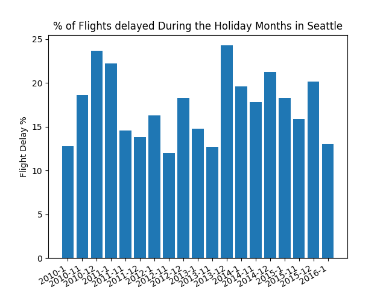
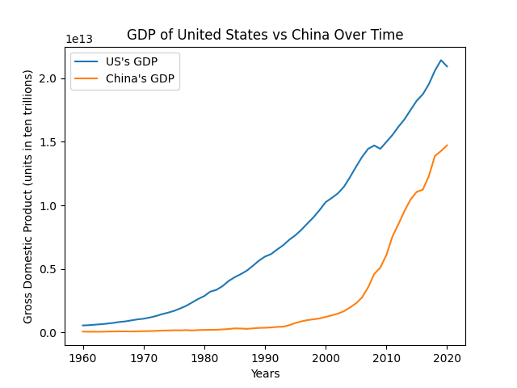

# HW_02

## Percent Of Flights Delayed at Seattle During The Holiday Season

I used a combination of delay data and total flights to find the percent of flights at Seattle's Airport that are delayed during the holiday months (November, December, and January). The data can be found [here.](https://think.cs.vt.edu/corgis/datasets/json/airlines/airlines.json)
## GDP Comparison Of The US and China

I pulled from two different data files to be able to compare the growth of GDP for the US and China. The data can be found [here for the US](http://api.worldbank.org/v2/countries/USA/indicators/NY.GDP.MKTP.CD?per_page=5000&format=json) and [here for China.](http://api.worldbank.org/v2/countries/CHN/indicators/NY.GDP.MKTP.CD?per_page=5000&format=json)

https://github.com/mikeizbicki/cmc-csci040/tree/2021fall/hw_02
